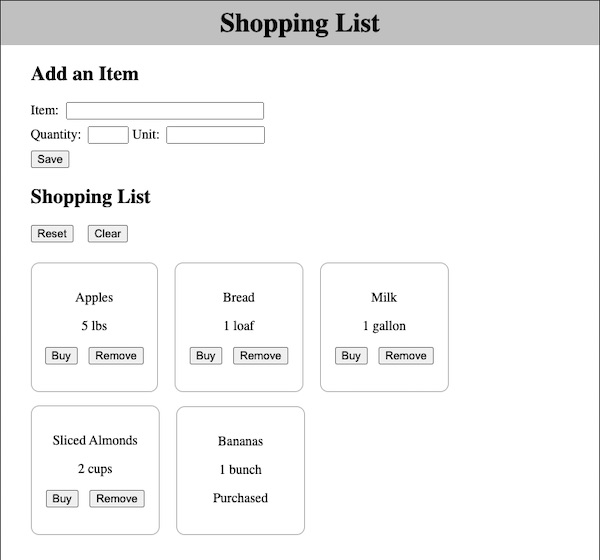

# React Shopping List

Isn't it just the worst when you come back from grocery shopping only to realize you forgot the most important thing! We're going to make a simple shopping list app to solve that problem. 

## Technologies

- *S*QL
- *E*xpress
- *R*eact
- *N*ode

## Requirements

We want to store a list of items to buy in a database, so we can build up our list over a period of time and then go shopping. 

There should be a form at the top of the page where we can add new items to the list.

Each item can have a:

- Name - text, allow up to 80 characters (required)
- Quantity - allow for decimal numbers (required)
- Unit - text, allow up to 20 characters (optional)

When the page first loads, all the existing items should be displayed with the quantity & unit combined together for display. Each item should also have an option to remove it from the list or mark it as purchased. Once purchased, the buttons should be hidden and the item should show as "Purchased". 

Items should initially appear alphabetically, but as items are marked purchased they should sort to the end of the list.

The `Reset` button should clear the purchased status from all items, allowing the list to be re-used. The `Clear` button should remove all items from the list, deleting them from the database.

#### Hint for Marking as purchased/removing item
>> If you've set up your components as we have shown, you should have an `Item` Component. That item should have access to every property of the item *object* -- this will be critical to successfully calling a PUT or DELETE route with the id (`/:id`). 

### Sample Wireframe

### Tips for Teams

- Remember to use branches and GitHub Pull-Requests. Make sure to protect your `main` branch as you setup the project.

- Plan your database structure as a group, making sure that you consider all of your required features.

- Plan to break down the UI (user interface) into smaller components. Discussing this upfront as a team is very helpful as you start to discuss tasks.

- Consider the naming for routes while planning to make sure everyone has the same expecations. Note the url in the tasks. 

- __Don't__ have team members work *only* on client or *only* on server code. Everyone needs to practice working with both sides. One option is to break features out as slices that include both the client and server code. Another is to create separate tasks for client and server code, but plan so that all team members get both a client task and a server task, even if they are for different features.

- Aim to ensure that everyone is always able to move forward on a task (or at least part of a task) without waiting for someone else to complete their work. For example, by setting up test data in the database, team members can work on getting items & adding items at the same time. Also, by starting work on the server side code to do a delete while the UI is being created allows work to move forward before there is a place to click a button. 

## Stretch Features 

- Update this Readme file to use the [Template](https://github.com/PrimeAcademy/readme-template) and fill in the sections.

- Add a confirmation dialog to the reset and clear button so that when the user clicks,  they are prompted to confirm whether they *really* want to perform that action. (Check out [Sweet Alerts](https://www.npmjs.com/package/@sweetalert/with-react).)

- Add indicators to the UI to show which fields are required.  On Save, validate that all inputs have a value. 
  - On the client side, you can do this by making the HTML inputs `required`. 
  - However you should also do this on the server side and send back a friendly message if the required data is not provided.
  - Optionally, make sure the text entered isn't too long.

- Improve the styling of the page
  - When items are purchased, grey them out. 
  - Make the buttons more UX friendly. For example, red for remove, but green or blue for save & buy.
  - Add a icons to improve the display, for example a check mark for purchased, a trash can for remove, etc. (Check out [Font Awesome](https://fontawesome.com/how-to-use/on-the-web/using-with/react).)

- Currently, if you typo something, it must be removed and re-added to fix it. An edit feature would be a great enhancement. Add an `Edit` button which will have the existing data show in the input form at the top of the page to allow an easier edit. 

  > Hint: For the edit, add a boolean indicator to the component state to indicate if the item is in view or edit mode. 
